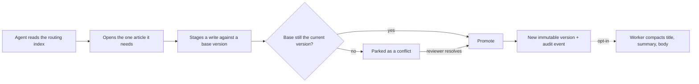

<div align="center">


# Rementum

**One versioned, auditable brain behind every AI agent.**

Self-hosted shared memory for Claude, Codex, Cursor, and any remote MCP client.

[](LICENSE)
[](https://www.typescriptlang.org/)
[](https://github.com/pgvector/pgvector)
[](https://modelcontextprotocol.io/)

[Documentation](https://rementum.dev/docs/) · [Install](https://rementum.dev/docs/installation/) · [Security](https://rementum.dev/docs/security/) · [Contributing](CONTRIBUTING.md)

</div>

---

Rementum gives your agents a memory they can trust. Knowledge lives in linked, encrypted Markdown
articles. **Every canonical change is staged, versioned, attributed, and conflict-checked** before it
replaces the previous version, so two agents never overwrite each other's work.

## Why Rementum

- 🧠 **Agent-first:** agents read a compact routing index, then open only the article it points to.
- 📝 **Staged writes:** each proposal is checked against live canon before it lands; conflicts wait for review instead of overwriting.
- 🔒 **Encrypted at rest:** article bodies use a per-brain key. The master key never touches the database or backups.
- 🔎 **Hybrid search:** Rementum fuses routing metadata, PostgreSQL full-text, and local multilingual embeddings.
- 🤝 **Coordinated agents:** leased tasks and maintenance proposals flow back through the same staged protocol.
- 📦 **Yours to keep:** self-hosted, open source, and exportable as Markdown whenever you want.

## How it works

An agent never loads the whole brain. It reads a compact index, opens the one article it needs, and
proposes changes through a staged protocol that checks for conflicts before anything replaces the
current version.



Rementum writes article summaries locally by default. Workspace owners can opt into deferred title,
summary, and body compaction through an OpenAI-compatible provider.

## Quick start

Point a domain at a Linux host with Docker Compose, open ports 80 and 443, then:

```bash
git clone https://github.com/rementum/rementum.git
cd rementum
./scripts/install.sh
```

The installer generates instance secrets, builds the stack, runs migrations, waits for health checks,
creates the first owner, and lets Caddy provision HTTPS. Update an installed instance later with
`./scripts/update.sh`, which backs up, fast-forwards, migrates, and rebuilds.

See the [installation guide](https://rementum.dev/docs/installation/) and [operations guide](https://rementum.dev/docs/operations/) for
requirements, backups, and recovery.

## Security

Rementum encrypts article and version bodies at rest. External LLM capability and workspace compaction
are **off by default**. With both on, the worker sends a version's title and body to the provider in
plaintext to compact it. Treat routing metadata and embeddings as sensitive derived data; they stay
searchable. Rementum never stores the master key in the database or backups.

Read [SECURITY.md](SECURITY.md) and the [security checklist](https://rementum.dev/docs/security/) before you store private
knowledge. Report vulnerabilities through the process in SECURITY.md, not a public issue.

## Documentation and contributing

The full docs are at **[rementum.dev/docs](https://rementum.dev/docs/)**: configuration, backups,
upgrades, security, and agent connections. For local setup and checks, read the
[development guide](https://rementum.dev/docs/development/) and [CONTRIBUTING.md](CONTRIBUTING.md).

> **Status:** active development toward a production beta. REST and MCP contracts are versioned. We
> don't promise backward compatibility until 1.0.

## License

[AGPL-3.0-only](LICENSE).
