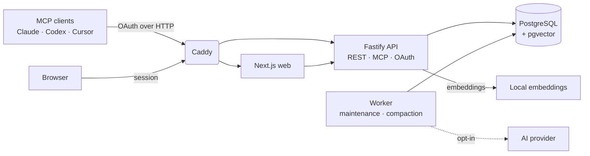

<div align="center">


# Rementum

**One versioned, auditable brain behind every AI agent.**

Self-hosted shared memory for Claude, Codex, Cursor, and any remote MCP client.

[](LICENSE)
[](https://www.typescriptlang.org/)
[](https://github.com/pgvector/pgvector)
[](https://modelcontextprotocol.io/)

[Documentation](https://rementum.dev/docs/) · [Install](docs/installation.md) · [Security](docs/security.md) · [Contributing](CONTRIBUTING.md)

</div>

---

Rementum gives your agents a memory they can trust. Knowledge lives in linked, encrypted Markdown
articles, and **every canonical change is staged, versioned, attributed, and conflict-checked** before
it replaces what came before — so agents can write to shared memory without silently overwriting it.

## Why Rementum

- 🧠 **Agent-first** — a compact routing index lets agents find the right article, then open only that one.
- 📝 **Staged writes** — proposals are reviewed against live canon; conflicts are parked, not merged blindly.
- 🔒 **Encrypted at rest** — article bodies use a per-brain key; the master key never touches the database or backups.
- 🔎 **Hybrid search** — routing metadata, PostgreSQL full-text, and local multilingual embeddings, fused.
- 🤝 **Coordinated agents** — leased tasks and maintenance proposals flow back through the same staged protocol.
- 📦 **Yours to keep** — self-hosted, open source, and exportable as portable Markdown at any time.

## Architecture



Article summaries are generated locally by default. Workspace owners can opt into deferred title,
summary, and body compaction through an OpenAI-compatible provider.

## Quick start

Point a domain at a Linux host with Docker Compose, open ports 80 and 443, then:

```bash
git clone https://github.com/rementum/rementum.git
cd rementum
./scripts/install.sh
```

The installer generates instance secrets, builds the stack, runs migrations, waits for health checks,
creates the first owner, and lets Caddy provision HTTPS. Update an installed instance later with
`./scripts/update.sh`, which backs up, fast-forwards, migrates, and rebuilds.

See the [installation guide](docs/installation.md) and [operations guide](docs/operations.md) for
requirements, backups, and recovery.

## Security

Article and version bodies are encrypted at rest. External LLM capability and workspace compaction are
**off by default**; when both are enabled, the worker sends a version's title and body to the provider
in plaintext to compact it. Routing metadata and embeddings stay searchable and must be treated as
sensitive derived data. The master key is never stored in the database or backups.

Read [SECURITY.md](SECURITY.md) and the [security checklist](docs/security.md) before storing private
knowledge, and report vulnerabilities privately rather than in an issue.

## Documentation & contributing

Full docs live at **[rementum.dev/docs](https://rementum.dev/docs/)** (configuration, backups, upgrades,
security, and agent connections) and in [`docs/`](docs/index.md). For local setup and checks, read
[docs/development.md](docs/development.md) and [CONTRIBUTING.md](CONTRIBUTING.md).

> **Status:** active development toward a production beta. REST and MCP contracts are versioned;
> backward compatibility is not promised until 1.0.

## License

[AGPL-3.0-only](LICENSE).
