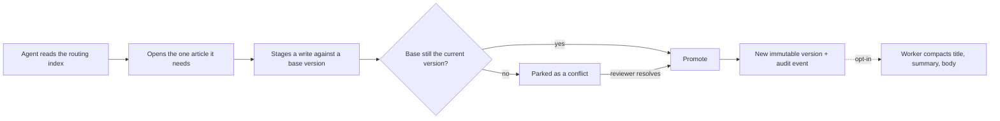

<div align="center">


# Rementum

**One versioned, auditable brain behind every AI agent.**

Self-hosted shared memory for Claude, Codex, Cursor, and any remote MCP client.

[](LICENSE)
[](https://www.typescriptlang.org/)
[](https://github.com/pgvector/pgvector)
[](https://modelcontextprotocol.io/)

[Documentation](https://rementum.dev/docs/) · [Install](https://rementum.dev/docs/installation/) · [Security](https://rementum.dev/docs/security/) · [Contributing](CONTRIBUTING.md)

</div>

---

Rementum gives your agents a memory they can trust. Knowledge lives in linked, encrypted Markdown
articles. **Every canonical change is staged, versioned, attributed, and conflict-checked** before it
replaces the previous version, so two agents never overwrite each other's work.

## Why Rementum

- 🧠 **Agent-first:** agents read a compact routing index, then open only the article it points to.
- 📝 **Staged writes:** each proposal is checked against live canon before it lands; conflicts wait for review instead of overwriting.
- 🔒 **Envelope encryption:** article bodies use per-brain keys and position-bound AAD; titles and metadata stay searchable.
- 🔎 **Hybrid search:** Rementum fuses routing metadata, PostgreSQL full-text, and local multilingual embeddings.
- 🤝 **Coordinated agents:** leased tasks and maintenance proposals flow back through the same staged protocol.
- 📦 **Yours to keep:** self-hosted, open source, and exportable as Markdown whenever you want.

## How it works

An agent never loads the whole brain. It reads a compact index, opens the one article it needs, and
proposes changes through a staged protocol that checks for conflicts before anything replaces the
current version.



Rementum writes article summaries locally by default. Workspace owners can opt into deferred title,
summary, and body compaction through an OpenAI-compatible provider.

## Quick start

You can evaluate Rementum locally on your machine without a domain, or deploy it to a Linux server for production with automated TLS.

### Option 1: Local evaluation (no domain required)

Run the full stack locally in 2 minutes using Docker Compose:

```bash
git clone https://github.com/rementum/rementum.git
cd rementum
cp .env.example .env
docker compose up -d
./scripts/create-owner.sh owner@example.com "Owner"
```

Open [http://localhost](http://localhost) in your browser.

- **Web dashboard:** Sign in with the owner email and password you just created.
- **Connect an agent:** Open **Teams**, copy your workspace MCP URL (`http://localhost/mcp/workspace/WORKSPACE_ID`), and connect Claude Code, Codex, Cursor, or any MCP client.

### Option 2: Production deployment (server with domain & HTTPS)

Deploy on a Linux server with automated HTTPS via Caddy and encrypted backups:

```bash
git clone https://github.com/rementum/rementum.git
cd rementum
./scripts/install.sh
```

The interactive installer prompts for your domain (e.g. `memory.example.com`), generates cryptographic secrets, starts the stack, runs migrations, creates the first owner, and provisions TLS certificates. Update later with `./scripts/update.sh`.

See the [installation guide](https://rementum.dev/docs/installation/) and [operations guide](https://rementum.dev/docs/operations/) for requirements, backups, and recovery.

## Security

Rementum uses application-layer envelope encryption with searchable metadata. Article and version
bodies are encrypted with AES-256-GCM using per-brain data keys sealed with position-bound AAD,
wrapped by an instance master key that never touches the database or backups. Article titles,
routing summaries, slugs, backlinks, and vector embeddings remain unencrypted in PostgreSQL so
hybrid search works without client-side decryption; treat them as sensitive derived data.

External LLM capability and workspace compaction are **off by default**. With both on, the worker
sends a version's title and body to the provider in plaintext to compact it.

Read [SECURITY.md](SECURITY.md) and the [security checklist](https://rementum.dev/docs/security/) before you store private
knowledge. Report vulnerabilities through the process in SECURITY.md, not a public issue.

## Design decisions and FAQ

### How does Rementum protect agent context windows and token budgets?
Dumping entire codebases or large documentation files into an agent's prompt quickly exhausts context limits and inflates token costs. Rementum optimizes token economy at three layers:
- **Compact routing index (~200 tokens):** Agents first call `get_brain` to inspect a lightweight list of titles and one-sentence summaries, then fetch only the specific article they need (`read_article` or `load_context`).
- **OAuth scope-based tool filtering:** The tool catalog is filtered strictly to the scopes granted during authentication. Clients receive only the tool definitions they have permission to execute.
- **Task and maintenance tools stay deferred:** Coding plugins (Claude Code, Cursor, Codex) load only core retrieval and staging skills (`brain-context`, `brain-write`). Background maintenance and task-claiming tools are invoked on demand rather than crowding the everyday prompt.
- **Stateless catalog caching:** Modern MCP clients receive a 5-minute private cache header on the tool catalog, eliminating redundant schema discovery requests.

### Can my team or company use Rementum internally under AGPL-3.0?
**Yes.** Rementum is an independent network service that agents connect to over standard network protocols (MCP / HTTP).
- **Internal usage is not distribution:** Self-hosting Rementum inside your organization or team does not trigger copyleft requirements or require opening your proprietary code, applications, or private knowledge.
- **Why AGPL-3.0?** The license prevents cloud platforms or proprietary SaaS wrappers from taking Rementum, offering it as a closed commercial service, and withholding their changes. If you modify Rementum itself and offer it to external users over a network, those modifications must remain open source.

### Is Rementum truly local and private? What about external LLM compaction?
By default, Rementum makes **zero external network requests**:
- **100% local by default:** Multilingual embeddings run locally using the bundled Granite-97M ONNX model (`apps/embeddings`), routing summaries are generated locally by the API process, and article bodies are encrypted with AES-256-GCM.
- **Double opt-in for compaction:** Deferred title and body compaction is disabled by default. It requires an instance-level provider configuration (`REMENTUM_LLM_ENABLED=true`) *and* explicit per-workspace activation by a workspace owner or admin.
- **Works with local engines (Ollama, vLLM, LocalAI):** The optional compaction worker connects to any OpenAI-compatible Chat Completions endpoint with JSON Schema support. You can point `REMENTUM_LLM_BASE_URL` to a local Ollama or vLLM instance for a completely air-gapped, zero-cloud deployment.

## Documentation and contributing

The full docs are at **[rementum.dev/docs](https://rementum.dev/docs/)**: configuration, backups,
upgrades, security, and agent connections. For local setup and checks, read the
[development guide](https://rementum.dev/docs/development/) and [CONTRIBUTING.md](CONTRIBUTING.md).

> **Status:** active development toward a production beta. REST and MCP contracts are versioned. We
> don't promise backward compatibility until 1.0.

## License

Rementum is licensed under [AGPL-3.0-only](LICENSE).

Rementum is an independent network service. Running Rementum internally for your team or organization does not require open-sourcing your proprietary code or agent workflows. AGPL ensures that enhancements to the core platform itself remain open to the community.
