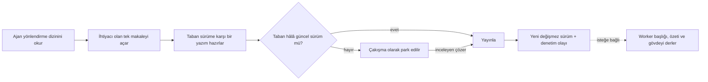

<div align="center">


# Rementum

**Her AI ajanının arkasında tek bir sürümlü, denetlenebilir brain.**

Claude, Codex, Cursor ve tüm uzak MCP istemcileri için self-hosted paylaşılan bellek.

[](LICENSE)
[](https://www.typescriptlang.org/)
[](https://github.com/pgvector/pgvector)
[](https://modelcontextprotocol.io/)

[English](README.md) · **Türkçe** · [中文](README.zh.md)

[Belgeler](https://rementum.dev/docs/) · [Kurulum](https://rementum.dev/docs/installation/) · [Güvenlik](https://rementum.dev/docs/security/) · [Katkı](CONTRIBUTING.md)

</div>

---

Rementum, ajanlarınıza güvenebilecekleri bir bellek verir. Bilgi, birbirine bağlı ve şifrelenmiş
Markdown makalelerinde yaşar. **Canlı içeriğe giren her değişiklik, önceki sürümün yerini almadan
önce hazırlanır, sürümlenir, atıflanır ve çakışma denetiminden geçer**; böylece iki ajan birbirinin
işinin üzerine yazmaz.

<div align="center">


*Görsel özet: ajanlar kompakt dizini okur, yazımları hazırlar ve tek bir sürümlü brain'i paylaşır. Tarayıcınızda çizilmiş halini [rementum.dev](https://rementum.dev/#how-it-works) üzerinde canlı görün.*

</div>

## Neden Rementum

- 🧠 **Ajan öncelikli:** ajanlar kompakt yönlendirme dizinini okur, sonra yalnızca dizinin işaret ettiği makaleyi açar.
- 📝 **Hazırlanmış yazımlar:** her öneri, yayına girmeden önce canlı içerikle karşılaştırılır; çakışmalar üzerine yazmak yerine inceleme bekler.
- 🔒 **Zarf şifreleme:** makale gövdeleri brain başına anahtar ve konuma bağlı AAD kullanır; başlıklar ve üst veriler aranabilir kalır.
- 🔎 **Hibrit arama:** Rementum yönlendirme üst verisini, PostgreSQL tam metin aramasını ve yerel çok dilli gömmeleri birleştirir.
- 🤝 **Eşgüdümlü ajanlar:** kiralanmış (leased) görevler ve bakım önerileri aynı hazırlama protokolünden geri akar.
- 📦 **Sizin kalır:** self-hosted, açık kaynak ve istediğiniz an Markdown olarak dışa aktarılabilir.

## Nasıl çalışır

Bir ajan brain'in tamamını asla yüklemez. Kompakt dizini okur, ihtiyacı olan tek makaleyi açar ve
herhangi bir şey güncel sürümün yerini almadan önce çakışma denetimi yapan hazırlama protokolü
üzerinden değişiklik önerir.



Rementum, makale özetlerini varsayılan olarak yerel üretir. Çalışma alanı sahipleri, OpenAI uyumlu
bir sağlayıcı üzerinden başlık, özet ve gövde derlemesini isteğe bağlı olarak açabilir.

## Hızlı başlangıç

Rementum'u kendi makinenizde alan adı olmadan deneyebilir ya da üretim için otomatik TLS ile bir
Linux sunucusuna kurabilirsiniz.

### Seçenek 1: Yerel deneme (alan adı gerekmez)

Docker Compose ile tüm yığını 2 dakikada yerelde çalıştırın:

```bash
git clone https://github.com/rementum/rementum.git
cd rementum
cp .env.example .env
docker compose up -d
./scripts/create-owner.sh owner@example.com "Owner"
```

Tarayıcınızda [http://localhost](http://localhost) adresini açın.

- **Web paneli:** az önce oluşturduğunuz sahip hesabının e-postası ve parolasıyla giriş yapın.
- **Bir ajan bağlayın:** **Takımlar** sayfasını açın, çalışma alanınızın MCP URL'sini (`http://localhost/mcp/workspace/WORKSPACE_ID`) kopyalayın ve Claude Code, Codex, Cursor veya herhangi bir MCP istemcisini bağlayın.

### Seçenek 2: Üretim kurulumu (alan adı ve HTTPS olan sunucu)

Caddy ile otomatik HTTPS ve şifreli yedeklerle bir Linux sunucusuna kurun:

```bash
git clone https://github.com/rementum/rementum.git
cd rementum
./scripts/install.sh
```

Etkileşimli kurulum betiği alan adınızı sorar (örn. `memory.example.com`), kriptografik anahtarları
üretir, yığını başlatır, migration'ları çalıştırır, ilk sahibi oluşturur ve TLS sertifikalarını alır.
Sonraki güncellemeler için `./scripts/update.sh`.

Gereksinimler, yedekleme ve kurtarma için [kurulum kılavuzuna](https://rementum.dev/docs/installation/)
ve [işletim kılavuzuna](https://rementum.dev/docs/operations/) bakın.

## Güvenlik

Rementum, aranabilir üst verilerle birlikte uygulama katmanında zarf şifreleme kullanır. Makale ve
sürüm gövdeleri, konuma bağlı AAD ile mühürlenmiş brain başına veri anahtarları kullanılarak
AES-256-GCM ile şifrelenir; bu anahtarları, veritabanına ve yedeklere hiçbir zaman dokunmayan bir
master key sarar. Makale başlıkları, yönlendirme özetleri, slug'lar, geri bağlantılar ve vektör
gömmeleri hibrit arama istemci tarafında çözme gerektirmeden çalışsın diye PostgreSQL'de şifresiz
kalır; bunları hassas türev veri olarak değerlendirin.

Harici LLM yeteneği ve çalışma alanı derlemesi **varsayılan olarak kapalıdır**. İkisi de açıkken
worker, bir sürümün başlığını ve gövdesini derlemek için sağlayıcıya düz metin olarak gönderir.

Özel bilgi saklamadan önce [SECURITY.md](SECURITY.md) dosyasını ve
[güvenlik kontrol listesini](https://rementum.dev/docs/security/) okuyun. Güvenlik açıklarını genel
bir issue yerine SECURITY.md'deki süreçle bildirin.

## Mimari kararlar ve SSS

Mimari ödünleşimlerimiz, neden Git yerine PostgreSQL seçtiğimiz, token verimliliği, AGPL-3.0
lisanslaması veya yerel LLM derlemesi hakkında ayrıntı mı arıyorsunuz?
**[Mimari kararlar ve SSS](https://rementum.dev/docs/faq/)** kılavuzunu okuyun.

## Belgeler ve katkı

Belgelerin tamamı **[rementum.dev/docs](https://rementum.dev/docs/)** adresinde: yapılandırma,
yedekleme, yükseltme, güvenlik ve ajan bağlantıları. Yerel kurulum ve kontroller için
[geliştirme kılavuzunu](https://rementum.dev/docs/development/) ve [CONTRIBUTING.md](CONTRIBUTING.md)
okuyun.

> **Durum:** üretim beta'sına doğru aktif geliştirme. REST ve MCP sözleşmeleri sürümlüdür. 1.0'a
> kadar geriye dönük uyumluluk taahhüt etmiyoruz.

## Lisans

Rementum [AGPL-3.0-only](LICENSE) lisansı altındadır.

Rementum bağımsız bir ağ hizmetidir. Rementum'u ekibiniz veya kuruluşunuz içinde çalıştırmak, tescilli
kodunuzu ya da ajan iş akışlarınızı açık kaynak yapmanızı gerektirmez. AGPL, çekirdek platformun
kendisine yapılan iyileştirmelerin topluluğa açık kalmasını sağlar.

---

Bu dosya, İngilizce [README.md](README.md) dosyasının çevirisidir. İkisi çeliştiğinde İngilizce
sürüm geçerlidir.
