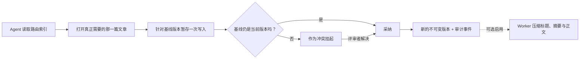

<div align="center">


# Rementum

**每个 AI Agent 背后，只有一个版本化、可审计的 Brain。**

为 Claude、Codex、Cursor 及所有远程 MCP 客户端提供的自托管共享记忆。

[](LICENSE)
[](https://www.typescriptlang.org/)
[](https://github.com/pgvector/pgvector)
[](https://modelcontextprotocol.io/)

[English](README.md) · [Türkçe](README.tr.md) · **中文**

[文档](https://rementum.dev/docs/) · [安装](https://rementum.dev/docs/installation/) · [安全](https://rementum.dev/docs/security/) · [参与贡献](CONTRIBUTING.md)

</div>

---

Rementum 让你的 Agent 拥有可信赖的记忆。知识存放在相互链接、加密的 Markdown 文章中。
**每一次正式变更在取代上一版本之前，都会先经过暂存、版本化、归属记录与冲突检查**，
因此两个 Agent 永远不会覆盖彼此的工作。

<div align="center">


*图示概览：Agent 读取精简索引、暂存写入，并共享同一个版本化 Brain。也可在 [rementum.dev](https://rementum.dev/#how-it-works) 上查看浏览器中实时绘制的版本。*

</div>

## 为什么选择 Rementum

- 🧠 **Agent 优先：** Agent 读取精简路由索引，然后只打开索引指向的那一篇文章。
- 📝 **暂存写入：** 每份提案在正式落地前都会与当前内容核对；冲突会等待评审，而不是直接覆盖。
- 🔒 **信封加密：** 文章正文使用每个 Brain 独立的数据密钥和与位置绑定的 AAD；标题与元数据保持可搜索。
- 🔎 **混合检索：** Rementum 融合路由元数据、PostgreSQL 全文检索与本地多语言向量嵌入。
- 🤝 **协同的 Agent：** 租约任务与维护提案都通过同一套暂存协议回流。
- 📦 **归你所有：** 自托管、开源，随时可导出为 Markdown。

## 工作原理

Agent 从不会加载整个 Brain。它读取精简索引，打开真正需要的那一篇文章，并通过暂存协议提交
变更——在有任何内容取代当前版本之前，该协议会先做冲突检查。



Rementum 默认在本地生成文章摘要。工作区所有者可以选择通过 OpenAI 兼容的服务商，
启用延迟的标题、摘要与正文压缩。

## 快速开始

你可以在本机、无需域名的情况下评估 Rementum，也可以部署到 Linux 服务器上用于生产环境，由系统自动配置 TLS。

### 方案 1：本地评估（无需域名）

使用 Docker Compose 在 2 分钟内本地运行完整技术栈：

```bash
git clone https://github.com/rementum/rementum.git
cd rementum
cp .env.example .env
docker compose up -d
./scripts/create-owner.sh owner@example.com "Owner"
```

在浏览器中打开 [http://localhost](http://localhost)。

- **Web 仪表盘：** 使用刚创建的所有者邮箱与密码登录。
- **连接 Agent：** 打开 **团队**，复制工作区的 MCP URL（`http://localhost/mcp/workspace/WORKSPACE_ID`），然后连接 Claude Code、Codex、Cursor 或任意 MCP 客户端。

### 方案 2：生产部署（带域名与 HTTPS 的服务器）

在 Linux 服务器上部署，由 Caddy 自动配置 HTTPS，并启用加密备份：

```bash
git clone https://github.com/rementum/rementum.git
cd rementum
./scripts/install.sh
```

交互式安装脚本会询问你的域名（例如 `memory.example.com`），生成加密密钥、启动技术栈、
执行数据库迁移、创建首位所有者，并申请 TLS 证书。后续更新使用 `./scripts/update.sh`。

环境要求、备份与恢复请参阅[安装指南](https://rementum.dev/docs/installation/)与[运维指南](https://rementum.dev/docs/operations/)。

## 安全

Rementum 在应用层使用信封加密，同时保持元数据可搜索。文章与版本正文使用 AES-256-GCM 加密，
密钥为每个 Brain 独立的数据密钥、以与位置绑定的 AAD 封存，再由一把从不进入数据库或备份的
实例主密钥包裹。文章标题、路由摘要、slug、反向链接与向量嵌入在 PostgreSQL 中保持未加密，
以便混合检索无需客户端解密即可工作；请把它们视为敏感的派生数据。

外部 LLM 能力与工作区压缩**默认关闭**。两者都开启时，Worker 会把某个版本的标题与正文
以明文发送给服务商进行压缩。

在存储私密知识之前，请先阅读 [SECURITY.md](SECURITY.md) 与[安全检查清单](https://rementum.dev/docs/security/)。
请通过 SECURITY.md 中的流程报告漏洞，而不要提交公开 issue。

## 架构决策与常见问题

想了解我们的架构取舍、为什么选择 PostgreSQL 而不是 Git、token 效率、AGPL-3.0 授权，
或本地 LLM 压缩？请阅读**[架构决策与常见问题](https://rementum.dev/docs/faq/)**指南。

## 文档与贡献

完整文档位于 **[rementum.dev/docs](https://rementum.dev/docs/)**：配置、备份、升级、安全与
Agent 连接。本地环境搭建与各项检查请阅读[开发指南](https://rementum.dev/docs/development/)
与 [CONTRIBUTING.md](CONTRIBUTING.md)。

> **状态：** 正在积极开发，目标为生产 beta。REST 与 MCP 契约均已版本化。在 1.0 之前，
> 我们不承诺向后兼容。

## 许可证

Rementum 采用 [AGPL-3.0-only](LICENSE) 许可证。

Rementum 是一个独立的网络服务。在团队或组织内部运行 Rementum，不需要开源你的专有代码或
Agent 工作流。AGPL 确保核心平台本身的改进始终对社区保持开放。

---

本文件是英文版 [README.md](README.md) 的翻译。两者如有冲突，以英文版为准。
